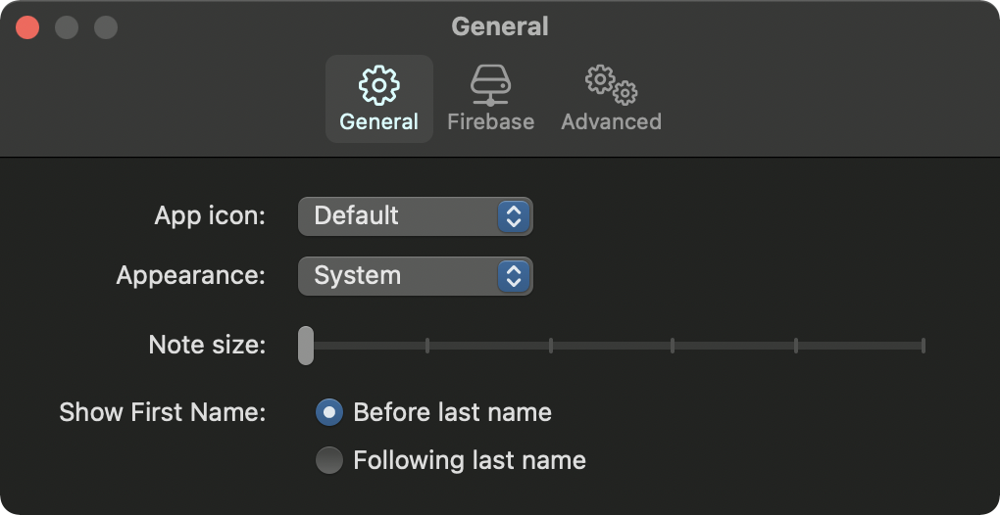
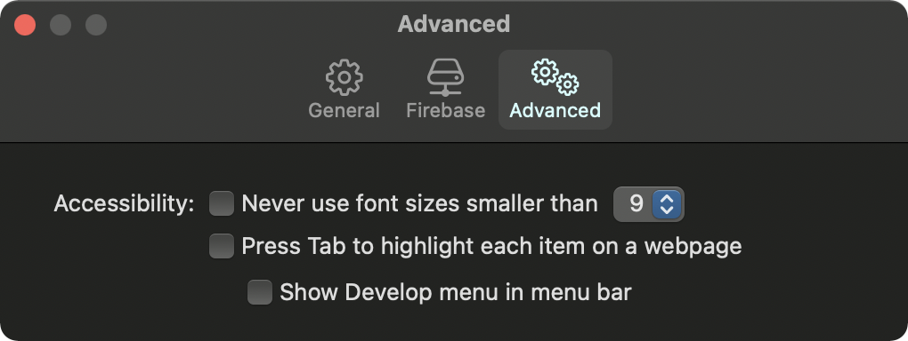

#  Preference Example

Example of creating a preferences window for macOS app with SwiftUI

   

  

## Dependencies
- Xcode 13+
- macOS 11.3+

## Swift Package Dependencies
- [Preferences](https://github.com/sindresorhus/Preferences)

## References
- [How to create a preferences window in Big Sur with SwiftUI](https://dariogzlez.medium.com/creating-a-preferences-window-for-a-swiftui-macos-app-52b684a2bdf)
- [macOSアプリ用の環境設定ウインドウの作成方法](https://qiita.com/IKEH/items/e11911d01a417b577353)
- [Manners of Preferences Window on macOS](https://speakerdeck.com/1024jp/manners-of-preferences-window-on-macos)
